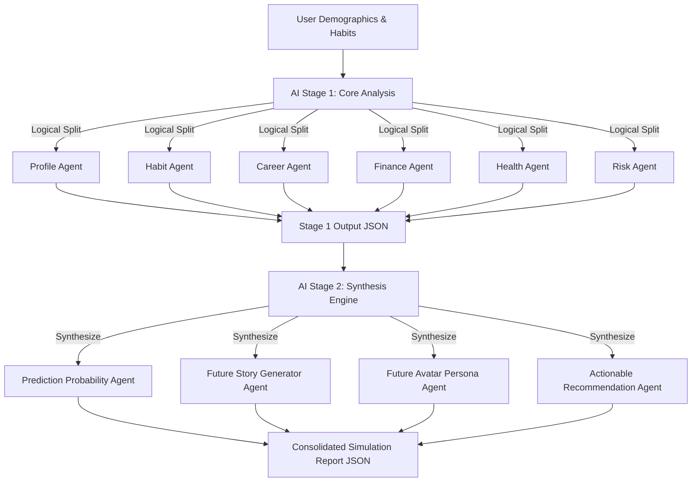

# Future Self Simulator

Future Self Simulator is a production-quality, AI-powered life simulation SaaS platform that helps users visualize how their current habits, career choices, financial decisions, health practices, and goals compound to shape their futures over the next 1, 5, and 10 years. 

---

## 1. System Architecture

The project is structured as a TypeScript monorepo containing a Next.js 15 frontend and an Express.js Node backend. It is designed to run in two modes controlled by the `PROVIDER_MODE` environment variable:
1. **Local Mode (`PROVIDER_MODE=local`)**: Uses a local file-based database for profile/habit persistence, local JWT keys, and leverages the **Groq API** (or falls back to a high-fidelity rule-based engine if no keys are found). Perfect for quick deployment on **Render + GitHub**.
2. **AWS Mode (`PROVIDER_MODE=aws`)**: Connects to **Amazon Cognito** for authentication, **Amazon DynamoDB** for single-table storage, **Amazon S3** for report uploads, and **Amazon Bedrock** (Claude 3.5 Sonnet / Nova Pro) for simulation orchestration.

### Multi-Agent Pipeline Workflow


---

## 2. Database Design (DynamoDB Single Table Schema)

In AWS mode, the platform utilizes a Single Table Design under the table name `FutureSelfSimulatorTable` with keys:
- **Partition Key (`PK`)**: `String`
- **Sort Key (`SK`)**: `String`

### Key Mappings:
| Entity | PK | SK | Attributes |
| :--- | :--- | :--- | :--- |
| **User Metadata** | `USER#<userId>` | `METADATA` | `email`, `createdAt` |
| **Email Unique Check** | `USEREMAIL#<email>` | `METADATA` | `user` (nested object containing user ID) |
| **Profile Details** | `USER#<userId>` | `PROFILE` | `name`, `age`, `gender`, `country`, `income`, `occupation` |
| **Life Assessment** | `USER#<userId>` | `ASSESSMENT` | `health`, `career`, `finance`, `relationships`, `goals` |
| **User Habits** | `USER#<userId>` | `HABIT#<habitId>` | `name`, `type`, `frequency`, `duration`, `consistencyScore` |
| **Simulation Report** | `USER#<userId>` | `SIMULATION#<simId>` | `scores`, `probabilities`, `stories`, `avatar`, `letter`, `regrets` |
| **What-If Pivot** | `USER#<userId>` | `WHATIF#<whatifId>` | `query`, `outcome`, `scoresChange`, `createdAt` |

---

## 3. API Contract Documentation

All backend endpoints are prefixed with `/api`. Requests require a JSON payload. Protected endpoints require a `Authorization: Bearer <JWT_token>` header.

### Authentication
- `POST /api/auth/signup` - Registers a user. 
  - Payload: `{ "email": "user@test.com", "password": "Password123!" }`
- `POST /api/auth/signin` - Logs in a user, returning a session token.
  - Payload: `{ "email": "user@test.com", "password": "Password123!" }`
  - Response: `{ "token": "JWT_STRING_HERE", "email": "user@test.com", "userId": "UUID" }`

### Profiles & Assessments
- `GET /api/profile` - Fetch profile metadata.
- `POST /api/profile` - Save profile. Payload: `{ "name": "Alex", "age": 28, "gender": "male", "occupation": "Engineer", "income": 80000, "country": "USA" }`
- `GET /api/assessment` - Fetch current multi-dimensional life indicators.
- `POST /api/assessment` - Save assessment indicators (JSON object matching schema).

### Habits
- `GET /api/habits` - Retrieve active positive/negative habits.
- `POST /api/habits` - Add a new habit. Payload: `{ "name": "Daily Coding", "type": "positive", "frequency": "daily", "duration": 60, "consistencyScore": 85 }`
- `DELETE /api/habits/:id` - Delete a habit by ID.

### Simulations
- `POST /api/simulations/run` - Gathers user stats and triggers the 10-Agent simulation engine.
- `GET /api/simulations/latest` - Fetch latest compiled simulation report.
- `POST /api/simulations/whatif` - Run custom What-If forks. Payload: `{ "query": "What if I move abroad?" }`

---

## 4. Local Development Setup

Follow these steps to run both frontend and backend on your local computer.

### Prerequisites
- Node.js 20 or higher
- npm

### Step 1: Clone and Set Up Environments
Create a `.env` file in the `backend/` directory:
```env
PORT=5000
PROVIDER_MODE=local
JWT_SECRET=dev-secret-string-change-in-prod
GROQ_API_KEY=your_groq_api_key_here
```
*(If you leave `GROQ_API_KEY` blank, the platform automatically switches to a high-fidelity local mock engine, allowing you to test all UI components instantly without configuration!)*

### Step 2: Boot Backend
```bash
cd backend
npm install
npm run dev
```
The Express backend starts at `http://localhost:5000`.

### Step 3: Boot Frontend
```bash
cd ../frontend
npm install
npm run dev
```
The Next.js frontend starts at `http://localhost:3000`.

### Running with Docker Compose
If you prefer running inside Docker containers:
```bash
# Set your Groq API key in your terminal session, then run:
docker-compose up --build
```

---

## 5. Deployment Guide

### Deploying Backend to Render (Local Mode with Groq)
1. Fork your repository to GitHub.
2. In the Render Dashboard, click **New + Web Service** and link your repository.
3. Configure settings:
   - **Root Directory**: `backend`
   - **Runtime**: `Node`
   - **Build Command**: `npm install && npm run build`
   - **Start Command**: `node dist/server.js`
4. In **Environment Variables**, add:
   - `PROVIDER_MODE`: `local`
   - `JWT_SECRET`: `your-random-production-key`
   - `GROQ_API_KEY`: `your-live-groq-key`
5. Deploy. Render will expose a public URL (e.g. `https://my-backend-app.onrender.com`).

### Deploying Frontend to Vercel
1. In Vercel, click **Add New Project** and link your repository.
2. Configure settings:
   - **Root Directory**: `frontend`
   - **Build Command**: `npm run build`
   - **Output Directory**: `.next`
3. In **Environment Variables**, add:
   - `NEXT_PUBLIC_API_URL`: `https://my-backend-app.onrender.com/api` (Point to your Render URL)
4. Deploy.

### Deploying to AWS Production (using Terraform)
1. Run Terraform scripts in `infrastructure/terraform/`:
   ```bash
   cd infrastructure/terraform
   terraform init
   terraform apply
   ```
2. Terraform will output your Cognito User Pool ID, client ID, DynamoDB Table name, and S3 Bucket.
3. Deploy the backend to AWS Lambda (zipped) or an ECS container, mapping the environment variables to the created resources. Set `PROVIDER_MODE=aws`.
